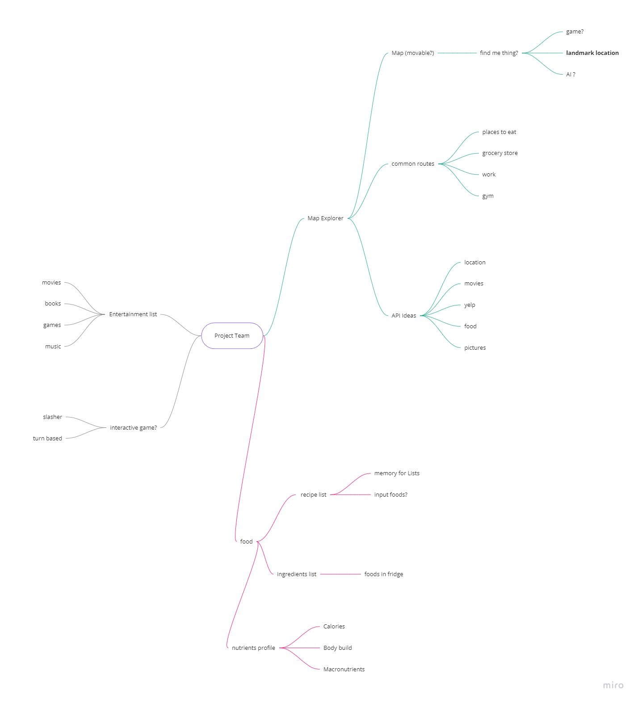
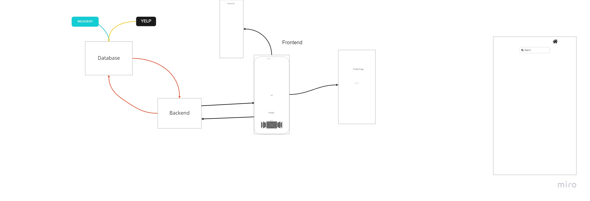

# DiscoverWare
- This app allows a user to locate and save any location they desire, saving said locations will display information about that location.
- This app requires a user account/log-in that the app will recognize in order to accurately generate saved data.

## Team Members:
- Isaiah Keller (Front-end)
- Brandon Ge (Front-end)
- Tim Traylor (Back-end)
- Jacob Dang (Back-end)

## Project Description:
- The interface of this app offers the potential for an individual to virtually navigate any city, landmark, or destination that piques their interest. This attends to the interactivity and encouragement of citizens to explore their surrounding environment. With this app, this will allow the user to engage in their environment curiosity and do so with comfortability and ease.

## Problem Domain:
- Nowadays our current environment encourages the practice of the home-body mentality. The pandemic has further pushed that agenda and for a while our community boundaries were confined in a single living space. Shifting that stay-at-home mentality from where we were only a few years ago is more difficult than any of us could've imagined. We seek to aleviate that with this app, that allows the user to explore what's around them.

## Semantics Versionings/Updates:
- Version 0.1: Created front-end and developed a skeleton framework
- Version 0.2: Created back-end and developed a skeleton framework
- Version 0.3: Back-end now has CRUD features
- Version 0.4: Front-end & Back-end implement an Auth0 feature
- Version 0.5: Front and Back end debugs
- Version 0.6: Front-end adds styling with Boostrap & CSS
- Version 1.0: Final product

## Additional Resources:
- Implements React, Bootstrap, Express, MongoDB, Mongoose, Auth0, Axios
- 3rd Party Integrations: Google Maps API, Google Places API, @react-google-maps/api library on npm

# Starting DiscoverWare
- Fork the repo
- Install dependencies (within package.json)
- Set .env according to .envsample
- Test using npm test (for frontend) and nodemon (for backend)
- Requires personal database as well as authentication token for testing
- Run node seed.js to seed database

## API Endpoints & Examples:
- '/place' would allow the user to access the database endpoint for saved locations, used for GET & POST
- '/place/:id' would lead the user to specific ID, used for PUT & DELETE

## Database Schema:
    email: { type: String, required: true },
    name: {type: String, required: true},
    address: {type: String, required: true},
    lat: {type: Number, required: true},
    lng: {type: Number, required: true},
    place_id: {type: String, required: true},
    image: {type: String},
    types: {type: Array},
    notes: {type: String}

# Previous Ideas:
- A representation of our pitches and brainstorming
        

# Data Flow
- Describe the flow of data in your application:
        

**Authors**:
    - Branden Ge
    - Isaiah Keller
    - Jacob Dang
    - Tim Traylor
**Git Organization**:
- [DiscoveryChannel301](https://github.com/DiscoveryChannel301)

**Git Repositories**:
- [Front-End](https://github.com/ijkeller/DiscoverWare-Client)
- [Backend](https://github.com/ijkeller/DiscoverWare-API)

**Deployed Links**:
- [Netlify](https://ijk-discoverware.netlify.app/)
- [Heroku](https://discoverware-backend.herokuapp.com/)

